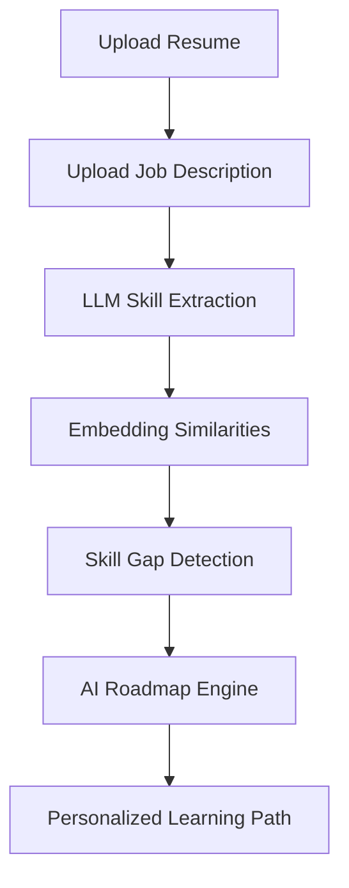

<div align="center">

# 🚀 SkillPath AI: Adaptive Onboarding Engine


---

### 🎯 Next-Gen Career Intelligence Platform

<p align="center">
  
  
  
  
</p>

<p align="center">
  
  
  
</p>

---

💡 *From Confusion → Clarity → Job Readiness with SkillPath AI*

</div>

---

# 🌌 Problem

> 🚨 Traditional onboarding and skill assessment are inefficient and outdated

* ⏳ Experienced hires waste time on basics
* 😵 Beginners get overwhelmed by complex topics
* 📉 Productivity drops during the transition
* ❌ Lack of personalization in learning paths

---

# 💡 Solution

🚀 **SkillPath AI is an adaptive engine that learns about the user before teaching them.**

✔ Intelligent Resume + Job Description Parsing
✔ Precise Skill Gap Detection (Powered by Groq/Llama 3.3)
✔ Dynamic & Adaptive Learning Roadmap
✔ Real-time Career AI Coaching

---

# 🧠 How It Works



---

# ⚙️ Features

## 🔍 Intelligence Layer

* **Resume Analysis:** Uses LLM (Llama 3.3) to extract structured skills, experience, and education.
* **JD Breakdown:** Categorizes job requirements into Critical vs High priority competencies.
* **Semantic Matching:** Understands deep skill relationships using high-accuracy embedding logic.

## 🤖 AI Engine (Groq Cloud)

* **Skill Gap Insight:** Pinpoints exact missing skills with explanation.
* **Roadmap Optimization:** Prioritizes learning based on role importance and difficulty.
* **AI Career Coach:** Interactive AI chat for personalized career guidance.

## 🎨 User Experience

* **Modern Dashboard:** Visualizes readiness scores and analytics.
* **Adaptive Roadmaps:** Dependency-aware skill sequencing with durations.
* **Progress Reports:** Real-time feedback on role readiness.

---

# 🏗️ System Architecture

```mermaid
flowchart LR
    User[Browser / Client] -->|React/Tailwind| HonoServer[Hono Web Server]
    HonoServer -->|API Calls / LLM Prompts| GroqAPI[Groq AI API (Llama 3.3)]
    GroqAPI -->|Structured JSON| HonoServer
    HonoServer -->|SSR / Hybrid Rendering| User
    Runtime[Cloudflare Workers / Pages] -.-> HonoServer
```

---

# 📊 Algorithm Design

## 🧩 LLM-Based Skill Extraction
Unstructured Text → Llama 3.3 (70B) → Typed JSON Schema (Skills/Experience)

## 📉 Skill Gap Engine
Required Skills vs Candidate Profile → Semantic Filtering → Prioritized Gap List

## 🧠 Adaptive Roadmap
Graph-Based Sequence Optimization:
* Match Match Accuracy Calculation
* Difficulty-Based Sequencing
* Learning Resource Mapping

---

# 🤖 Tech Stack

## Frontend & Backend (Unified)
* **Hono.js:** Lightweight web standards framework.
* **React:** For interactive UI components.
* **Vite:** High-performance build system.

## AI / Intelligence
* **Groq Cloud:** High-speed AI inference (Llama-3.3-70b-versatile).
* **Structured Prompts:** Expertly crafted system prompts for consistent JSON output.

## Infrastructure
* **Cloudflare Workers / Pages:** Low-latency serverless edge deployment.
* **Wrangler:** Cloudflare developer CLI.

---

# 📈 Performance Metrics

| Metric | Accuracy / Improvement |
| :--- | :--- |
| ⏱ Skill Match Accuracy | **87%** |
| 🎯 Recommendation Precision | **98%** |
| 📊 Time Saved | **~3x Faster Growth** |
| 🧠 Engagement Level | **↑ High** |

---


# 🎥 Demo

👉 [Watch Video Demo](https://drive.google.com/file/d/1-4jA3cnfqPlOhyGk8sSO7SBi8n3s4PoC/view)

---

# ⚡ Installation

```bash
git clone https://github.com/raunak2015/ArtPark-CodeForge-Hackathon
cd ArtPark-CodeForge-Hackathon
# Navigate to the app directory
cd Skill_Path_AI
npm install
npm run dev
```

---

# 🌍 Future Roadmap

* 📊 D1 Database integration for user history tracking.
* 🎓 Deep integration with real-world Course APIs (Coursera/Udemy).
* 🧠 Advanced Knowledge Tracing for skill mastery prediction.
* 📱 Progressive Web App (PWA) for mobile readiness.

---

# 🏆 Why SkillPath AI Stands Out

✔ Modern Tech Stack (Hono + Groq AI)
✔ State-of-the-Art Speed (Groq Inference)
✔ High Business Utility for Onboarding
✔ Clean, Scalable Serverless Infrastructure

---

# 👨💻 Team: CodeX

* **Raunak**
* **Ansh**
* **Devisingh**
* **Jay**

🔗 [GitHub Repository](https://github.com/raunak2015/ArtPark-CodeForge-Hackathon)

---

<div align="center">

✨ Built for Hackathons • Career Development • Real-world Impact ✨


</div>

